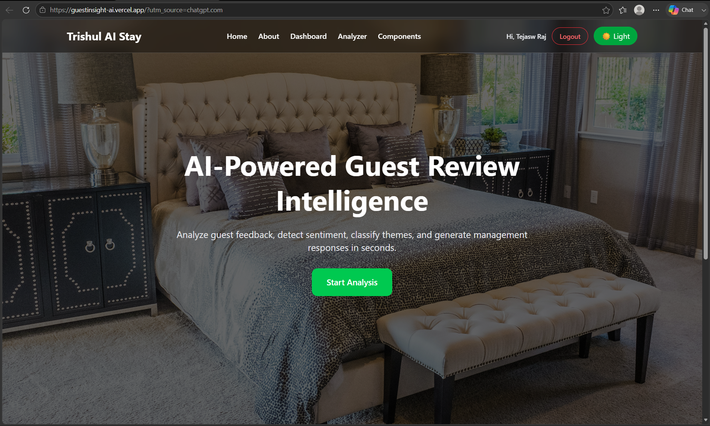
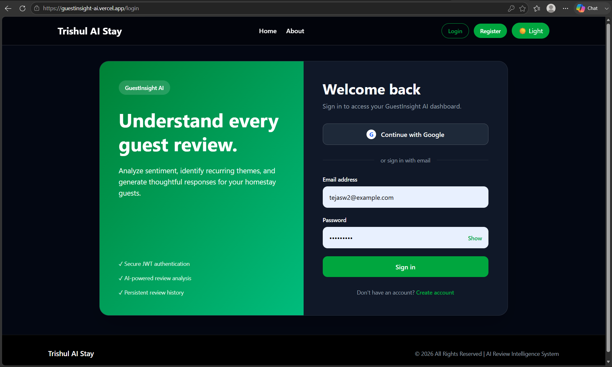
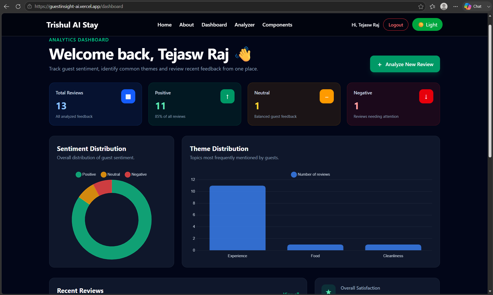
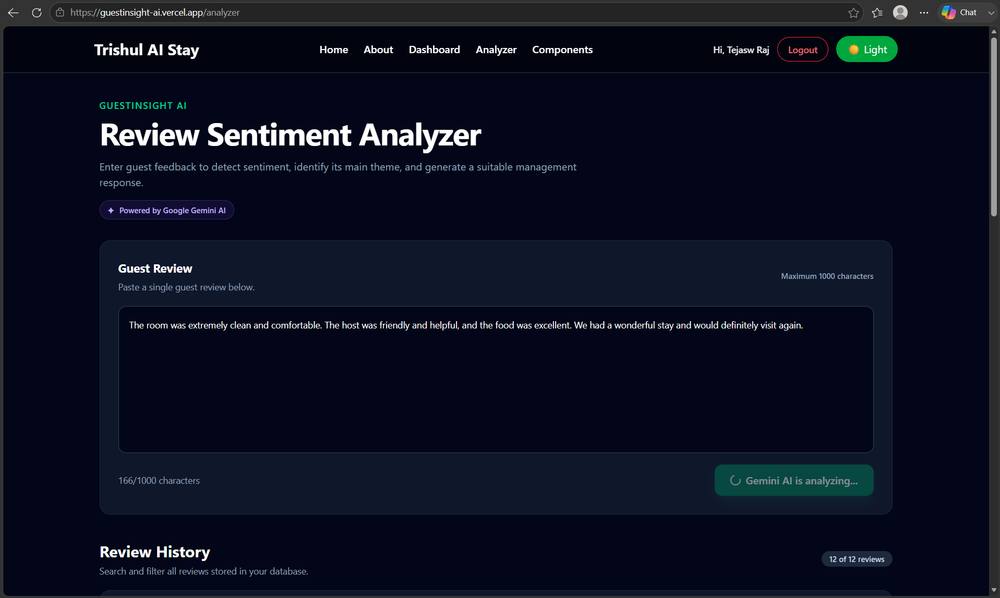

# GuestInsight AI

### AI-Powered Guest Review Analysis for Homestays

| Project Information | Details |
|---|---|
| **Project Type** | Internship Project |
| **Intern ID** | TBI-26101383 |
| **Developer** | Tejasw Raj |
| **University** | Graphic Era (Deemed to be University) |
| **Frontend** | React + Vite |
| **Backend** | Node.js + Express |
| **Database** | MongoDB Atlas |
| **AI** | Gemini API |

---

## 🔗 Project Links

| Resource | URL |
|---|---|
| 🌐 **Live Demo** | https://guestinsight-ai.vercel.app/ |
| ⚙️ **Backend** | https://guestinsight-ai-backend.onrender.com |
| 💻 **GitHub Repository** | https://github.com/tejasw24/guestinsight-ai |

---

## 📌 Project Overview

GuestInsight AI is a full-stack web application built to make guest review management easier for homestay staff. It uses AI to analyze guest feedback and provide useful information such as sentiment, review themes, confidence scores, and suggested responses.

The application combines a responsive React frontend with a Node.js and Express backend, MongoDB for data storage, and an AI-powered review analysis service.

---

## Problem & Solution

| Problem | How GuestInsight AI Helps |
|---|---|
| Guest reviews take time to analyze manually | AI analyzes reviews within seconds |
| Sentiment can be difficult to identify consistently | Automatically classifies reviews as Positive, Neutral, or Negative |
| Important topics can be missed in long reviews | Identifies the main theme of the review |
| Staff may spend time writing repetitive responses | Generates a suggested response |
| Reviews can become difficult to manage over time | Provides a centralized dashboard for review management |

### The Problem

Guest reviews contain valuable information about a homestay experience, but manually going through every review can be time-consuming. It can also be difficult to consistently identify the sentiment and understand which part of the guest experience a review is referring to.

For a homestay team, this can make it harder to identify recurring issues and respond to guest feedback efficiently.

### The Solution

GuestInsight AI provides a simple platform where staff can enter guest reviews and receive an AI-assisted analysis.

Each review can be processed to provide:

| Output | Description |
|---|---|
| **Sentiment** | Positive, Neutral, or Negative |
| **Theme** | Identifies the main area discussed in the review |
| **Confidence** | Shows the AI confidence in its classification |
| **Suggested Response** | Provides a short response that can help staff reply to the guest |

The analyzed reviews can also be stored and managed through the application, including viewing, searching, updating, and deleting reviews.

---

## Key Features

| Feature | Description |
|---|---|
| 🤖 **AI Review Analysis** | Analyzes guest reviews and generates sentiment, theme, confidence score, and suggested response. |
| 🔐 **User Authentication** | Supports registration, login, JWT authentication, password hashing, Google OAuth, and protected routes. |
| 📝 **Review Management** | Allows users to create, view, search, update, and delete guest reviews. |
| 📊 **Review Insights** | Displays review information and sentiment counts through the dashboard. |
| 🎨 **Responsive Interface** | Provides a responsive React interface with reusable components, dark mode, loading states, validation, and notifications. |
| 🛡️ **Backend Security** | Uses authentication middleware, validation, rate limiting, CORS, and security middleware. |
| ☁️ **Cloud Deployment** | Frontend deployed on Vercel, backend on Render, and data stored in MongoDB Atlas. |

---

### Feature Flow

| Step | Process |
|---:|---|
| **01** | User signs in to GuestInsight AI |
| **02** | User enters a guest review |
| **03** | Backend processes the request |
| **04** | AI analyzes the review |
| **05** | Sentiment, theme, confidence, and response are returned |
| **06** | Result is displayed and can be stored for later management |

---

## Screenshots

| Home Page | Authentication |
|:---:|:---:|
|  |  |
| **Landing page and application introduction** | **User login and authentication interface** |

| Dashboard | AI Review Analysis |
|:---:|:---:|
|  |  |
| **Review management and sentiment overview** | **AI-generated sentiment, theme, confidence and response** |

---

## Tech Stack

| Layer | Technology | Purpose |
|---|---|---|
| **Frontend** | React + Vite | Building a fast and responsive user interface |
| **Styling** | Tailwind CSS | Responsive and modern UI design |
| **Routing** | React Router | Managing application navigation and protected routes |
| **Backend** | Node.js + Express | Building REST APIs and server-side logic |
| **Database** | MongoDB + Mongoose | Storing users and guest review data |
| **Authentication** | JWT + bcryptjs | Secure login, password hashing and protected APIs |
| **OAuth** | Google OAuth | Google-based authentication |
| **AI** | Gemini API | Review sentiment, theme analysis and response generation |
| **API Testing** | Postman | Testing and validating backend APIs |
| **Version Control** | Git + GitHub | Source control and project collaboration |
| **Frontend Hosting** | Vercel | Deploying the React frontend |
| **Backend Hosting** | Render | Deploying the Express backend |
| **Database Hosting** | MongoDB Atlas | Cloud-hosted MongoDB database |

---

## Architecture

GuestInsight AI follows a full-stack architecture where the React frontend communicates with the Express backend through REST APIs. The backend manages authentication, review operations, AI processing, and database communication.

```text
┌──────────────────────┐
│      User / Staff    │
└──────────┬───────────┘
           │
           ▼
┌──────────────────────┐
│     React + Vite     │
│       Frontend       │
│        Vercel        │
└──────────┬───────────┘
           │
           │ REST API
           ▼
┌──────────────────────┐
│   Node.js + Express  │
│       Backend        │
│        Render        │
└───────┬────────┬─────┘
        │        │
        │        ▼
        │   ┌──────────────┐
        │   │  Gemini API  │
        │   │ AI Analysis  │
        │   └──────────────┘
        │
        ▼
┌──────────────────────┐
│    MongoDB Atlas     │
│    Users + Reviews   │
└──────────────────────┘
```

### Project Structure

```text
guestinsight-ai/
│
├── backend/
│   ├── config/              # Database and application configuration
│   ├── controllers/         # Authentication, review and AI business logic
│   ├── data/                # Backend data and supporting resources
│   ├── middleware/          # Authentication, validation and security middleware
│   ├── models/              # MongoDB/Mongoose data models
│   ├── routes/              # REST API route definitions
│   ├── services/            # Supporting backend and external services
│   └── server.js            # Express application entry point
│
├── docs/
│   └── screenshots/          # Screenshots used in the README
│
├── public/                   # Public frontend assets
│
├── src/
│   ├── assets/              # Images and frontend assets
│   ├── components/          # Reusable React components
│   ├── context/             # Shared application and authentication state
│   ├── pages/               # Application pages and screens
│   ├── services/            # Frontend API configuration and communication
│   ├── App.jsx              # Main application structure and routing
│   └── main.jsx             # React application entry point
│
├── .gitignore                # Files excluded from version control
├── package.json              # Frontend dependencies and scripts
└── README.md                 # Project documentation
```

---

## AI Feature

GuestInsight AI uses **Google Gemini** to analyze guest reviews and turn unstructured feedback into useful, structured insights.

| AI Component | Implementation |
|---|---|
| **LLM** | Google Gemini API |
| **Input** | Guest review text |
| **AI Endpoint** | `POST /api/ai/analyze` |
| **Sentiment** | Positive, Neutral, or Negative |
| **Theme** | Main topic of the guest review |
| **Confidence** | AI confidence score |
| **Suggested Response** | AI-generated response for the guest |
| **Authentication** | JWT required for the AI request |
| **API Key Security** | Stored using environment variables |

---

## AI Workflow

```text
Guest Review
     │
     ▼
React Analyzer
     │
     │ POST /api/ai/analyze
     ▼
Express Backend
     │
     ▼
Google Gemini API
     │
     ▼
Structured AI Result
     │
     ├── Sentiment
     ├── Theme
     ├── Confidence
     └── Suggested Response
     │
     ▼
Backend
     │
     │ POST /api/reviews
     ▼
MongoDB Atlas
     │
     ▼
Review displayed in Dashboard
```

### AI Output

| Output | Example |
|---|---|
| **Sentiment** | Positive |
| **Theme** | Experience |
| **Confidence** | 98% |
| **Suggested Response** | A short, professional response generated for the guest |

---

## Authentication & Security

GuestInsight AI includes an authentication layer to protect user accounts and application data.

| Security Feature | Implementation |
|---|---|
| **User Registration** | New users can create an account with validated credentials |
| **User Login** | Email and password based authentication |
| **Password Security** | Passwords are hashed using `bcryptjs` |
| **JWT Authentication** | JWT tokens are used to authenticate protected requests |
| **Protected Routes** | Authenticated users can access protected application features |
| **Google OAuth** | Google-based authentication is supported |
| **Role-Based Access** | Middleware is used to control access based on user roles |
| **Input Validation** | Request data is validated before processing |
| **Rate Limiting** | Authentication endpoints are protected against excessive requests |
| **CORS** | Configured to allow communication between the deployed frontend and backend |
| **Environment Variables** | Secrets and API credentials are kept outside the source code |

---

## Authentication Flow

```text
User
 │
 ├── Register ──────────────┐
 │                          ▼
 │                    Validate Input
 │                          │
 │                          ▼
 │                    Hash Password
 │                          │
 │                          ▼
 │                    MongoDB Atlas
 │
 └── Login ─────────────────┐
                            ▼
                     Verify Credentials
                            │
                            ▼
                       Generate JWT
                            │
                            ▼
                     Store Token in Client
                            │
                            ▼
                    Access Protected Routes

Frontend
   │
   │ Authorization: Bearer <JWT>
   ▼
Express API
   │
   ▼
Authentication Middleware
   │
   ├── Valid Token ───────► Continue Request
   │
   └── Invalid Token ─────► Reject Request
```

---

## Backend APIs & Testing

The backend is built with **Node.js and Express** and provides REST APIs for authentication, review management, search, and AI-powered review analysis.

### API Endpoints

| Method | Endpoint | Purpose | Auth |
|---|---|---|---|
| `POST` | `/api/auth/register` | Register a new user | Public |
| `POST` | `/api/auth/login` | Authenticate a user | Public |
| `GET` | `/api/auth/me` | Get the current authenticated user | JWT |
| `GET` | `/api/reviews` | Retrieve saved reviews | JWT |
| `POST` | `/api/reviews` | Create and save a review | JWT |
| `GET` | `/api/reviews/:id` | Retrieve a specific review | JWT |
| `PUT` | `/api/reviews/:id` | Update an existing review | JWT |
| `DELETE` | `/api/reviews/:id` | Delete a review | JWT |
| `GET` | `/api/reviews/search` | Search saved reviews | JWT |
| `POST` | `/api/ai/analyze` | Analyze a guest review using AI | JWT |

---

### Two Key APIs

### 1. AI Review Analysis

| Request | Details |
|---|---|
| **Method** | `POST` |
| **Endpoint** | `/api/ai/analyze` |
| **Purpose** | Analyze guest review text using AI |
| **Input** | Guest review text |
| **Output** | Sentiment, theme, confidence and suggested response |
| **Authentication** | JWT |

#### Working

```text
Guest Review
     │
     ▼
POST /api/ai/analyze
     │
     ▼
Express Backend
     │
     ▼
Google Gemini API
     │
     ▼
AI Analysis Result
     │
     ├── Sentiment
     ├── Theme
     ├── Confidence
     └── Suggested Response
     │
     ▼
Frontend
```

---

## Database & Schema

GuestInsight AI uses **MongoDB Atlas** with **Mongoose** for database management. MongoDB was selected because the application works with flexible review data and AI-generated analysis results, making a document-based database a good fit.

### Database Selection

| Aspect | Details |
|---|---|
| **Database** | MongoDB |
| **Hosting** | MongoDB Atlas |
| **ODM** | Mongoose |
| **Data Model** | Document-based |
| **Primary Data** | Users and guest reviews |
| **Why MongoDB?** | Flexible schema, easy integration with Node.js and suitable for storing AI-generated review data |
| **Cloud Access** | MongoDB Atlas provides a managed cloud database |

### Database Structure

```text
GuestInsightDB
│
├── users
│   ├── User credentials
│   ├── Authentication data
│   └── User role information
│
└── reviews
    ├── Review text
    ├── Sentiment
    ├── Theme
    ├── Confidence
    ├── Suggested response
    └── Created / Updated timestamps
```

---

## Deployment & Hosting

GuestInsight AI is deployed as a full-stack application using separate hosting services for the frontend and backend, with MongoDB Atlas providing the cloud database.

### Hosting Setup

| Component | Hosting Service | Purpose | Status |
|---|---|---|---|
| **Frontend** | Vercel | Hosts the React production application | 🟢 Live |
| **Backend** | Render | Hosts the Node.js + Express REST API | 🟢 Live |
| **Database** | MongoDB Atlas | Stores users and guest review data | 🟢 Active |
| **AI Service** | Google Gemini API | Processes guest review analysis | 🟢 Active |
| **Source Code** | GitHub | Version control and repository hosting | 🟢 Active |

---

## Production Architecture

```text
                         INTERNET
                            │
                            ▼
                 ┌─────────────────────────┐
                 │     Vercel Frontend     │
                 │      React + Vite       │
                 └────────────┬────────────┘
                              │
                              │ HTTPS / REST API
                              ▼
                 ┌─────────────────────────┐
                 │      Render Backend     │
                 │    Node.js + Express    │
                 └──────────┬───────┬──────┘
                            │       │
                 ┌──────────┘       └──────────┐
                 ▼                             ▼
        ┌──────────────────┐          ┌──────────────────┐
        │  MongoDB Atlas   │          │   Gemini API     │
        │  Users + Reviews │          │   AI Analysis    │
        └──────────────────┘          └──────────────────┘
```

---

## Live Demo & Project Links

| Resource | Link |
|---|---|
| 🌐 **Live Application** | https://guestinsight-ai.vercel.app/ |
| ⚙️ **Backend API** | https://guestinsight-ai-backend.onrender.com |
| 💻 **GitHub Repository** | https://github.com/tejasw24/guestinsight-ai |
| 💼 **LinkedIn** | https://www.linkedin.com/in/tejasw-raj |

### Quick Access

**Live App:**  
https://guestinsight-ai.vercel.app/

**Repository:**  
https://github.com/tejasw24/guestinsight-ai

---

## Installation & Local Setup

### Prerequisites

| Requirement | Recommended |
|---|---|
| **Node.js** | 18+ |
| **npm** | Included with Node.js |
| **Git** | Latest stable version |
| **MongoDB** | MongoDB Atlas or local MongoDB |

### Clone and Install

```bash
git clone https://github.com/tejasw24/guestinsight-ai.git
cd guestinsight-ai
npm install
cd backend
npm install
```

---

## Internship Reflection

The internship gave me practical experience in taking a full-stack application from development to deployment. I improved my understanding of React, Node.js, Express, MongoDB, authentication, REST APIs, AI integration, Git, and cloud deployment.

The biggest learning for me was understanding how different parts of a real application work together. While deploying GuestInsight AI, I faced issues with frontend-backend communication, CORS, authentication, environment variables, and API configuration. Solving these problems helped me become more confident in debugging and deploying applications.

### Key Learnings

| Area | Learning |
|---|---|
| **Frontend Development** | Built responsive React interfaces and reusable components |
| **Backend Development** | Developed REST APIs using Node.js and Express |
| **Database** | Worked with MongoDB Atlas and Mongoose |
| **Authentication** | Implemented JWT, password hashing and Google OAuth |
| **AI Integration** | Integrated Gemini API for guest review analysis |
| **API Testing** | Tested backend APIs using Postman |
| **Deployment** | Deployed frontend on Vercel and backend on Render |
| **Debugging** | Improved troubleshooting of API, CORS and deployment issues |
| **Version Control** | Used Git and GitHub throughout the development process |

### Overall Experience

This internship helped me move beyond writing individual features and understand the complete development lifecycle of a full-stack application. It also improved my confidence in solving real development and deployment problems independently.

---

## Acknowledgements

This project was developed as part of the **TBI-GEU Internship Program**.

I would like to thank the **TBI-GEU Team** for providing the learning environment, resources, guidance, and practical experience throughout the internship.

The internship provided an opportunity to apply full-stack development concepts to a real-world use case and gain hands-on experience with modern web technologies, AI integration, databases, authentication, API development, testing, and deployment.

---

## License

This project was developed as an internship capstone project for educational and demonstration purposes.

---

## Project Status

| Feature | Status |
|---|---|
| Responsive Frontend | ✅ Complete |
| User Authentication | ✅ Complete |
| Google OAuth | ✅ Complete |
| Review CRUD Operations | ✅ Complete |
| AI Review Analysis | ✅ Complete |
| Sentiment & Theme Detection | ✅ Complete |
| AI Suggested Responses | ✅ Complete |
| MongoDB Integration | ✅ Complete |
| REST API Integration | ✅ Complete |
| API Testing | ✅ Complete |
| Vercel Deployment | ✅ Live |
| Render Deployment | ✅ Live |
| Production Frontend–Backend Integration | ✅ Complete |

---

## Final Notes

GuestInsight AI demonstrates the complete journey of a full-stack application — from frontend development and backend API design to database integration, AI-powered analysis, authentication, testing, and cloud deployment.

The project was developed with a focus on practical usability, clean architecture, responsive design, and real-world deployment.

---

## Contact

For project-related information, feedback, or collaboration:

**Developer:** Tejasw Raj  
**Project:** GuestInsight AI  
**GitHub:** https://github.com/tejasw24/guestinsight-ai  
**Live Application:** https://guestinsight-ai.vercel.app/